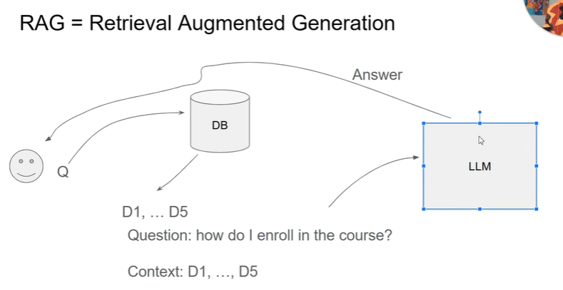

# Использование LLM для задачи RAG

LLM - large language model. Они содержат миллиарды параметров, они учились на огромных наборах данных, но если попросить их ответить на вопрос, относящийся к нашим частным данных, то скорее всего они не поймут о чем идет речь.

Для ответа на наш вопрос им нужно дать контекст, в котором они могут найти этот ответ.

## В этом и есть суть задачи RAG.

**RAG** - retrieval-augmented generation - это задача, в которой система должна найти подходящий контекст к ответу, а затем сгенерировать хороший, человекоподобный ответ на этот вопрос.

В качестве примера данных для курса мы будем использовать FAQ документ из других курсов DataTalksClub, в частности курсы ML Zoomcamp и DE Zoomcamp.

У нас есть любезно предоставленные пары вопрос ответ, и они уже подготовлены в виде json-документа авторами курса. Но это не очень сложная задача, и свои данные можно также подготовить для реализации системы RAG на своих данных.

# Общая картина как работает RAG


1. От пользователя приходит запрос Q
2. Мы обращаемся к базе знаний, и ищем документы релевантные этому запросу, и берем скажем 5 лучших совпадений
3. Отдаем вопрос и эти документы LLM в виде промпта
4. LLM смотрит на вопрос и на контекст, и строит ответ. При этом если в контексте нет данных для ответа - она отвечает специальным образом, можно об этом написать в промпте.

# Компоненты **RAG**:

* **Retriever** - поиск подходящего контекста (search engine)
* **Generator** - генерация ответа (llm)
## Retriever (search engine)

Можно использовать разные подходы, чтобы найти в нашем FAQ подходящие ответы на вопрос.  

Сначала, мы попробуем использовать простой поисковый движок, который Алексей сделал на вводном вебинаре, он использует pandas, и называется [minisearch](minisearch.py)

Потом мы попробуем поменять используемый движок, попробуем использовать elastic search во второй части урока.

## Generator (llm)

Мы будем рассматривать LLM как черный ящик, который принимает на вход "промпт" и генерирует текст ответа.  

Наш промт будет выглядеть примерно так:
```
question: [вопрос]
contexts: [ответ1, ответ2, ...]
answer: 
```

Слова в квадратных скобках будут заменены на реальные вопрос и ответы из FAQ.

Точный промпт, который мы делали в уроке
```python
prompt_template = """
You're a course teaching assistant. Answer the QUESTION based on the CONTEXT from the FAQ database.
Use only the facts from the CONTEXT when answering the QUESTION.

QUESTION: {question}

CONTEXT:
{context}
"""
```

## Мои ноутбуки

* Код урока можно посмотреть в [этом ноутбуке](along-the-lecture.ipynb)  
* Домашнее задание первой недели [тут](homework.ipynb)  


