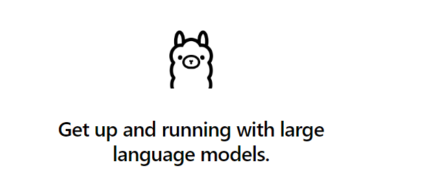

# Использование открытых LLM моделей

## Описание
Как альтернатива proprietory LLM есть открытые LLM. Это такие модели, чьи веса доступны публично, и их можно использовать на своем компьютере.
Обычно для хорошей работы таких моделей требуется видеокарта с большим количество памяти, но некоторые модели можно использовать и на CPU.

В данном разделе мы научились использованию такие модели
Первая часть требует наличия видеокарты, и мы использовали арендованный сервер и библиотеку `transformers` для загрузки модели и генерации текста.

## Hugging face


[Hugging face](https://huggingface.co/) - это платформа (а заодно и библиотека для python) для работы с LLM моделями. На платформе можно делиться весами обученных моделей, и использовать их для разных задач (в том числе для генерации текста).

Мы можем запускать модель локально, если у нас есть GPU, арендовать сервер (в курсе мы использовали Saturn Cloud) или использовать платформы на подобии Google Colab. 

Для работы с моделями на huggingface можно использовать библиотеку `transformers`. Она позволяет загружать модели и использовать их. 

На hugging face есть множество доступных публично моделей. Мы попробовали работать с некоторыми "небольними" LLM, которым хватило 16 Гб видеопамяти: 
- FLAN-T5 от Google
- PHI-3 от Microsoft
- Mistral 

Для запуска кода необходимо установить библиотеки: `transformers, accelerate, bitsandbytes, sentencepiece, torch`

Мои ноутбуки, с примерами запуска моделей:
* [FLAN-T5](<1. FLAT T5.ipynb>)
* [PHI-3](<2. PHI 3.ipynb>)
* [Mistral](<3. Mistral.ipynb>)

### Пример кода для работы с моделью FLAN-T5

```python
from transformers import T5Tokenizer, T5ForConditionalGeneration
tokenizer = T5Tokenizer.from_pretrained("google/flan-t5-xl")
model = T5ForConditionalGeneration.from_pretrained("google/flan-t5-xl", device_map="auto")
def llm(prompt, generate_params=None):
    if generate_params is None:
        generate_params = {}

    input_ids = tokenizer(prompt, return_tensors="pt").input_ids.to("cuda")
    outputs = model.generate(
        input_ids,
        max_length=generate_params.get("max_length", 100),
        num_beams=generate_params.get("num_beams", 5),
        do_sample=generate_params.get("do_sample", False),
        temperature=generate_params.get("temperature", 1.0),
        top_k=generate_params.get("top_k", 50),
        top_p=generate_params.get("top_p", 0.95),
    )
    result = tokenizer.decode(outputs[0], skip_special_tokens=True)
    return result

llm("What is the capital of France?")
```

### Важные замечания
* Для указания папки в которой хранить модели нужно указать переменную окружения
```python
os.environ['HF_HOME'] = '/run/cache/'
```
* Для некоторых моделей на huggingface необходимо принять соглашение, и потом для получения самой модели нужно залогиниться в api. Например для Mistral.

## Использование ollama



Также есть возможность запускать некоторые слабые LLM на своем комьютере, используя только процессор. Это будет гораздо хуже, чем запуск на GPU. Но может быть полезным в некоторых сценариях.

[Ollama](https://ollama.com/) это проект, который позволяет запукать LLM на своем компьютере. Также его можно использовать в рамках docker контейнера.


Установка в Linux:

```bash
curl -fsSL https://ollama.com/install.sh | sh

ollama serve 
```

Вести диалог можно в виде чата `ollama run phi3` или в виде вызова api. Можно использовать библиотеку openai, т.к. она поддерживает тотже api.

```python
from openai import OpenAI

client = OpenAI(
    base_url='http://localhost:11434/v1/',
    api_key='ollama',
)

```

Пример приложения которое мы сделали локально с использованием ollama и elasticsearch:
* [docker-compose](docker-compose.yaml)
* [ноутбук](4.run-ollama-local.ipynb)

## Streamlit чат

В качестве бонуса - сделали небольшой чат на streamlit, который использует проект в docker-compose с ollama и elasticsearch.

* [Streamlit application](qa_faq.py)


## Выводы

Технологии LLM это не только закрытые API, но и открытые модели, которые можно использовать самостоятельно.

Конечно они заметно уступают проприетарным, но тоже технологии продвигаются вперед, и открытые модели также становятся лучше (хоть и остаются на шаг позади)

## Ссылки

* [huggingface](https://huggingface.co/)
* [ollama](https://ollama.com/)
* [saturn cloud](https://saturncloud.io/)
* [лидерборд open llm](https://huggingface.co/spaces/open-llm-leaderboard/open_llm_leaderboard)
* [лидерборд open llm perf](https://huggingface.co/spaces/optimum/llm-perf-leaderboard)
* [LLM tutorial (huggingface)](https://huggingface.co/docs/transformers/en/llm_tutorial)