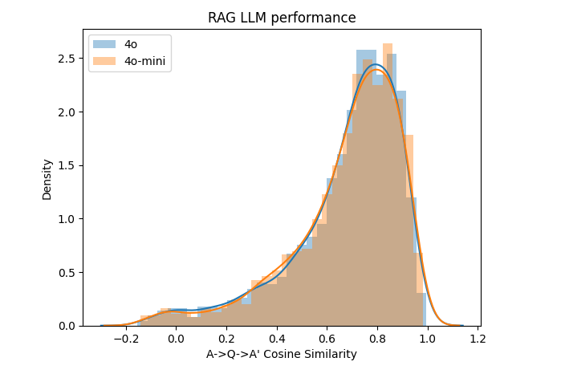

# Мониторинг качества работы LLM системы

## Почему это важно

* Нужно иметь понимание как работает система, чтобы обнаруживать проблемы и реагировать на них
* Также нужно иметь общее представление о качестве работы системы


## Виды оценки качества

**Оффлайн метрики:**
* Оценка качества ответа LLM на заранее известные вопросы с шаблонами ответами. 
* Сравнение ответов LLM с ответами человека на те же вопросы, можно использовать векторные представления, и замерять близость ответов.
* Также можно использовать технику LLM as a judgement, когда LLM оценивает качество ответа другого LLM.

**Онлайн метрики:**
* Можно записывать различные данные по ходу работы системы:
  * Какие вопросы задают пользователи
  * Feedback от пользователей (+1/-1)
  * Стоимость использования LLM
  * Количество запросов
  * Длительность обработки запроса
  * LLM оценка ответа на релевантность вопроса, а также на токсичность
* Онлайн метрики записываем в базу данных, и потом можно строить дашборды для мониторинга (например в Grafana)

## Оценка Cosine Similarity
* У нас с прошлого урока есть набор FAQ ответов и сгенерированных вопросов в ним.
* Мы можем использовать вопросы, получить на них ответы в нашей системе, и сравнить ответы с теми, что у нас есть.
* Для сравнения мы получаем embeddings ответов с помощью SentenceTransformer, и считаем Cosine Similarity между ответами.

```python
from sentence_transformers import SentenceTransformer
model_name = 'multi-qa-MiniLM-L6-cos-v1'
model = SentenceTransformer(model_name)


answer_orig = 'Yes, sessions are recorded if you miss one. Everything is recorded, allowing you to catch up on any missed content. Additionally, you can ask questions in advance for office hours and have them addressed during the live stream. You can also ask questions in Slack.'
answer_llm = 'Everything is recorded, so you won’t miss anything. You will be able to ask your questions for office hours in advance and we will cover them during the live stream. Also, you can always ask questions in Slack.'

v_llm = model.encode(answer_llm)
v_orig = model.encode(answer_orig)

v_llm.dot(v_orig)
```

Делаем так для всех ответов, и смотрим на распределение Cosine Similarity. Если оно будет сильно отличаться от 1, то это значит, что LLM отвечает не так как человек.




## Оценка LLM as a judgement

Примеры промптов для оценки качества ответа LLM на вопросы:

```python
prompt1_template = """
You are an expert evaluator for a Retrieval-Augmented Generation (RAG) system.
Your task is to analyze the relevance of the generated answer compared to the original answer provided.
Based on the relevance and similarity of the generated answer to the original answer, you will classify
it as "NON_RELEVANT", "PARTLY_RELEVANT", or "RELEVANT".

Here is the data for evaluation:

Original Answer: {answer_orig}
Generated Question: {question}
Generated Answer: {answer_llm}

Please analyze the content and context of the generated answer in relation to the original
answer and provide your evaluation in parsable JSON without using code blocks:

{{
  "Relevance": "NON_RELEVANT" | "PARTLY_RELEVANT" | "RELEVANT",
  "Explanation": "[Provide a brief explanation for your evaluation]"
}}
""".strip()

prompt2_template = """
You are an expert evaluator for a Retrieval-Augmented Generation (RAG) system.
Your task is to analyze the relevance of the generated answer to the given question.
Based on the relevance of the generated answer, you will classify it
as "NON_RELEVANT", "PARTLY_RELEVANT", or "RELEVANT".

Here is the data for evaluation:

Question: {question}
Generated Answer: {answer_llm}

Please analyze the content and context of the generated answer in relation to the question
and provide your evaluation in parsable JSON without using code blocks:

{{
  "Relevance": "NON_RELEVANT" | "PARTLY_RELEVANT" | "RELEVANT",
  "Explanation": "[Provide a brief explanation for your evaluation]"
}}
""".strip()
```

Первый промпт учитывает вопрос, исходный ответ и сгенерированный ответ. Второй промпт учитывает только вопрос и сгенерированный ответ.  
Он выдает оценку "NON_RELEVANT", "PARTLY_RELEVANT", или "RELEVANT", и мы можем сравнить количество оценок для разных вопросов.  

Интересно, что второй промпт может быть использовать для онлайн оценки качества работы LLM, когда пользователи оценивают ответы на вопросы. Мы можем эту оценку записывать в базу данных, и потом анализировать.  


## Онлайн метрики

* Мы можем записывать все запросы пользователей, и ответы LLM на них
* Можно записывать feedback от пользователей (+1/-1)
* Стоимость использования LLM
* Количество запросов
* Длительность обработки запроса
* LLM оценка ответа на релевантность вопроса, а также на токсичность

На основании этих данных можно строить дашборды для мониторинга качества работы системы.

Например запрос для панелей в grafana:

**Relevance Distribution Panel**

```sql
SELECT
  relevance,
  COUNT(*) as count
FROM conversations
WHERE timestamp BETWEEN $__timeFrom() AND $__timeTo()
GROUP BY relevance
```

**OpenAI Cost Panel**
```sql

SELECT
  $__timeGroup(timestamp, $__interval) AS time,
  SUM(openai_cost) AS total_cost
FROM conversations
WHERE timestamp BETWEEN $__timeFrom() AND $__timeTo()
  AND openai_cost > 0
GROUP BY 1
ORDER BY 1

```

** Feedback Statistics Panel**
```sql

SELECT
  SUM(CASE WHEN feedback > 0 THEN 1 ELSE 0 END) as thumbs_up,
  SUM(CASE WHEN feedback < 0 THEN 1 ELSE 0 END) as thumbs_down
FROM feedback
WHERE timestamp BETWEEN $__timeFrom() AND $__timeTo()

```

Пример docker-compose для запуска grafana:

```yaml
 grafana:
    image: grafana/grafana:latest
    container_name: grafana
    ports:
      - "3000:3000"
    volumes:
      - grafana_data:/var/lib/grafana
    environment:
      - GF_SECURITY_ADMIN_PASSWORD=${GRAFANA_ADMIN_PASSWORD:-admin}
    depends_on:
      - postgres
```


## Выводы

* Мониторинг качества работы LLM системы важен для обнаружения проблем и реагирования на них
* Можно использовать оффлайн и онлайн метрики для оценки качества работы системы
* Оффлайн метрики можно использовать для оценки качества ответов LLM на заранее известные вопросы
* Онлайн метрики можно использовать для оценки качества работы системы в реальном времени
* Онлайн метрики можно записывать в базу данных, и потом строить дашборды для мониторинга
